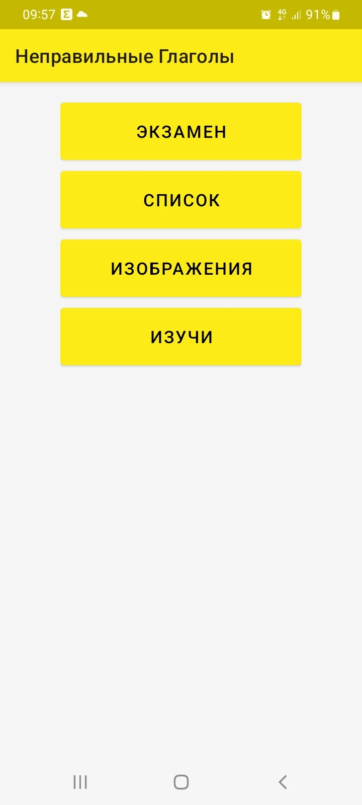
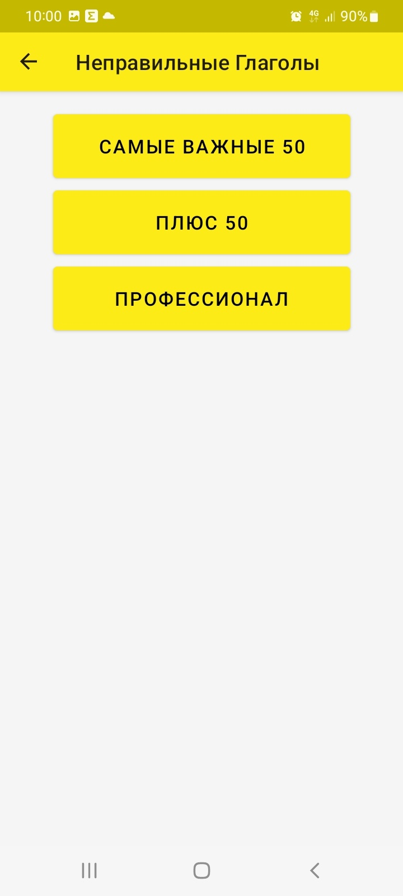
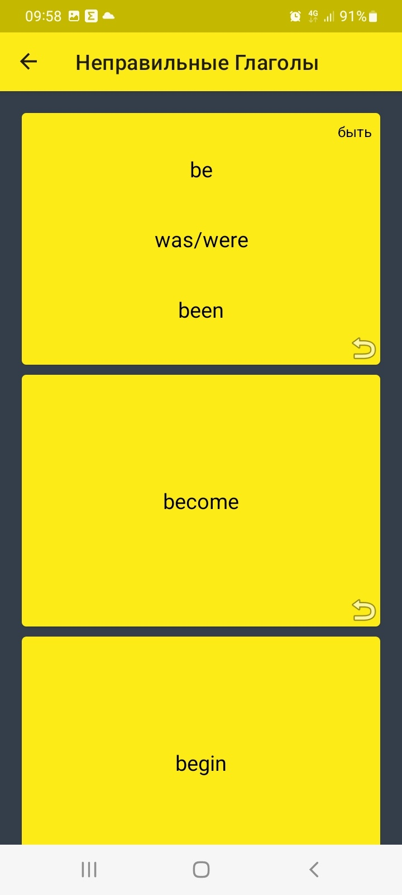
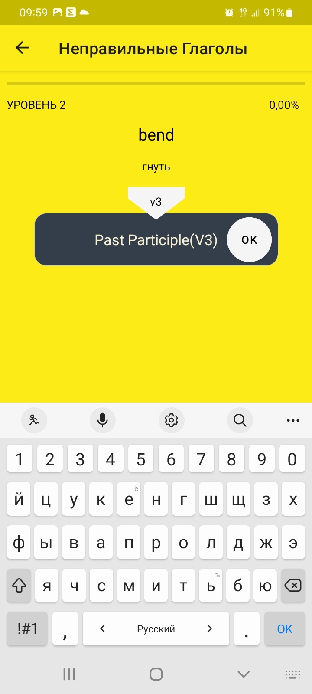
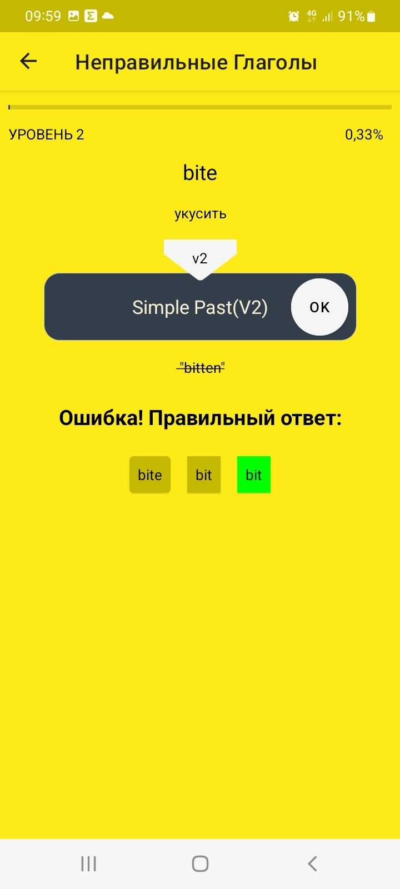

# IrregularVerbs
English Irregular Verb Trainer with list view, use case cards, and interactive flip cards. The simulator has a progress scale, as well as remembering the correct answers, which affects the display of verbs.
The language of the application depends on the language of the system, Russian support has been added, the default is English. On ImageView off-topic image for now

## Screenshot

  
  
  

  
  
  

## Video

https://github.com/MorRai/IrregularVerbs/screenshot/IrregularVerb.mp4

## Libraries and other stuff applied:
- Room
- Navigation
- WorkManager
- EasyFlip
- Koin
- Coroutine
- kts
- ViewModel
